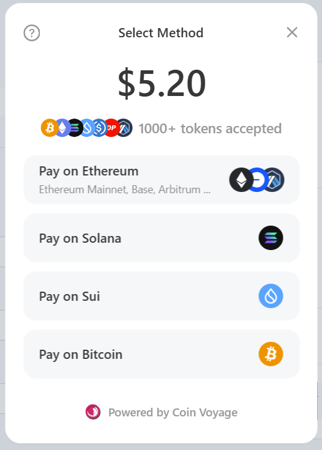



The `PayKitProvider` allows you to directly configure the theme, style and more of the `PayModal` (see image). The `PayModal` takes the user through the payment process and is shown upon interaction with the `PayButton`



<figure><figcaption></figcaption></figure>


