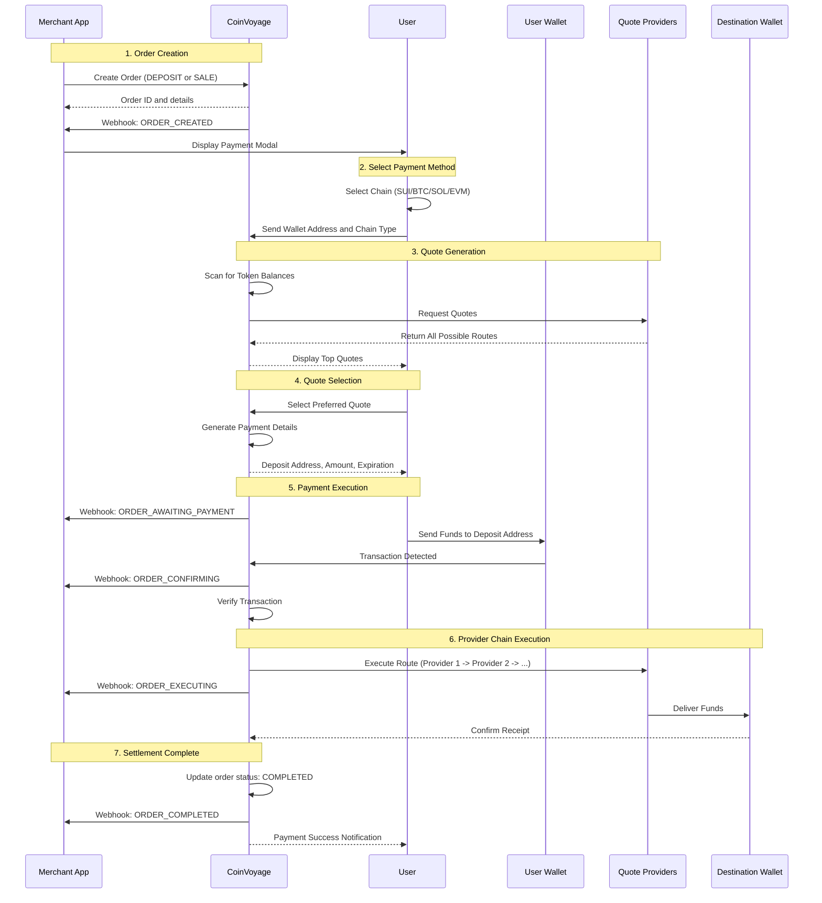

CoinVoyage handles the full complexity of cross-chain payments so you don't have to. When a user pays, CoinVoyage scans their wallet, fetches quotes from multiple liquidity providers, selects the optimal route, and executes each step in sequence — all the way through to settlement at your destination address. The sections below walk through every stage of that process.

## End-to-end payment flow

The sequence diagram below shows every actor and message involved in a complete payment:



## Detailed flow steps

<Steps>
  <Step title="Order creation">
    Your server (or the SDK's `ApiClient`) creates an order specifying the destination chain, asset, and amount. CoinVoyage returns an order ID and immediately fires an `ORDER_CREATED` webhook. You then pass that ID to the payment modal so the user can begin.

    The main create modes are **Deposit** and **Sale**. Refunds are created through the dedicated refund endpoint. See [Orders](/concepts/pay-orders) for details.

    ```typescript
    const order = await apiClient.createDepositOrder({
      amount: "10",
      currency: {
        chain_id: ChainId.SUI,
        address: null,
      },
      recipient: "0xYourWalletAddress",
    });
    ```
  </Step>

  <Step title="Payment method selection">
    The user opens the payment modal and picks their preferred chain and token. CoinVoyage supports payment from:

    - **SUI** — Sui blockchain
    - **BTC** — Bitcoin
    - **SOL** — Solana
    - **EVM** — Ethereum, Arbitrum, Base, Optimism, Polygon, BSC, and more

    Once the user selects a chain, they provide their wallet address so CoinVoyage can scan for available balances.
  </Step>

  <Step title="Quote generation">
    CoinVoyage builds quotes by:

    1. **Scanning wallet balances** to identify tokens the user can pay with
    2. **Querying providers** for live rates — AMMs (Uniswap V2, V3, and V4; Jupiter; Cetus), Across and CCTP for cross-chain routes, and direct same-chain transfers
    3. **Optimizing routes** by chaining providers together when that yields a better rate
    4. **Ranking quotes** by best effective output (highest received amount, lowest fees)

    The top quotes are surfaced to the user for selection.
  </Step>

  <Step title="Quote selection and payment details">
    After the user picks a quote, CoinVoyage generates the exact payment instructions for that route:

    - **Deposit address** — a unique address generated for this payment
    - **Exact amount** — the precise token amount to send
    - **Expiration time** — the payment window, typically 30 minutes
    - **Refund address** — where funds return if anything goes wrong

    A quote looks like this before the user confirms:

    ```
    Pay:            0.05 ETH (Ethereum)
    Receive:        10 SUI (Sui Network)
    Route:          Ethereum → CCTP → Sui
    Fee:            1.5%
    Estimated time: ~30 seconds
    ```
  </Step>

  <Step title="User payment">
    The user sends the exact amount to the deposit address from their wallet. CoinVoyage monitors the blockchain for:

    - **Transaction submission** — the payment has been broadcast
    - **On-chain confirmation** — the transaction is included in a block
    - **Amount verification** — the correct amount was received

    Your server receives an `ORDER_CONFIRMING` webhook as soon as the transaction is detected.
  </Step>

  <Step title="Backend execution">
    Once payment is confirmed, CoinVoyage executes the selected route. Routes can involve a single provider or a chain of providers:

    **Single-provider flow**

    ```
    User Payment → Provider → Destination
    Example: SOL → Direct Transfer → SOL (same chain)
    ```

    **Multi-provider chain**

    ```
    User Payment → Provider 1 → Provider 2 → Destination
    Example: ETH → Uniswap (ETH → USDC) → CCTP → SUI
    ```

    CoinVoyage handles route execution, error recovery, and real-time status webhooks throughout this stage. If any step fails, an automatic refund is initiated.

    <Note>
      Webhook subscriptions and delivered payloads use uppercase `ORDER_*` identifiers, such as `ORDER_EXECUTING`.
    </Note>
  </Step>

  <Step title="Settlement and completion">
    When funds arrive at the destination address, CoinVoyage marks the order as `COMPLETED` and fires the `ORDER_COMPLETED` webhook. All relevant transaction hashes are recorded on-chain.

    If execution fails at any point:

    1. An automatic refund is initiated
    2. Funds are returned to the user's refund address
    3. The order status changes to `REFUNDED`
    4. An `ORDER_REFUNDED` webhook is fired
  </Step>
</Steps>

## Provider chaining example

CoinVoyage can chain multiple providers together to find the best possible route for a given payment. Here is what that looks like when a user pays with ETH on Ethereum and you want to receive SUI:

```text
Step 1: User pays ETH on Ethereum
   |
Step 2: Uniswap swaps ETH → USDC (on Ethereum)
   |
Step 3: CCTP transfers USDC from Ethereum → Sui
   |
Step 4: Sui DEX swaps USDC → SUI
   |
Step 5: SUI delivered to your wallet
```

The entire process is:

- **Automated** — no manual intervention required at any step
- **Optimized** — the best route is calculated in real time before the user confirms
- **Transparent** — all fees, routes, and timing are shown to the user upfront
- **Fast** — typically completes in under 60 seconds
