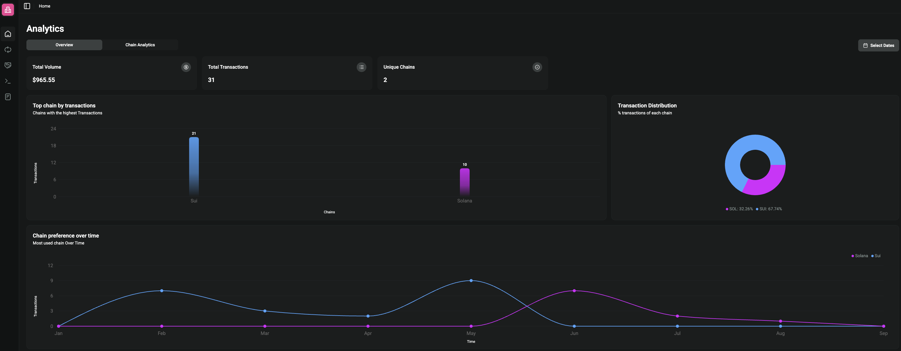

---
layout:
  width: default
  title:
    visible: false
  description:
    visible: false
  tableOfContents:
    visible: true
  outline:
    visible: true
  pagination:
    visible: true
  metadata:
    visible: true
---

# Analytics

### Analytics

&#x20;CoinVoyage's analytics provides a real-time and historical view of your payment activity across all supported chains and tokens.

<figure><figcaption></figcaption></figure>

Through [analytics](https://dashboard.coinvoyage.io/) you can get an overview of your payment performance through key metrics and reports to help you track and analyze your payment performance. It includes total volume, payment method usage, conversation rate, customer preferences and trends, etc

<figure><figcaption></figcaption></figure>

(note to self: include chain selection and date query)

<figure><figcaption></figcaption></figure> <figure><figcaption></figcaption></figure>

