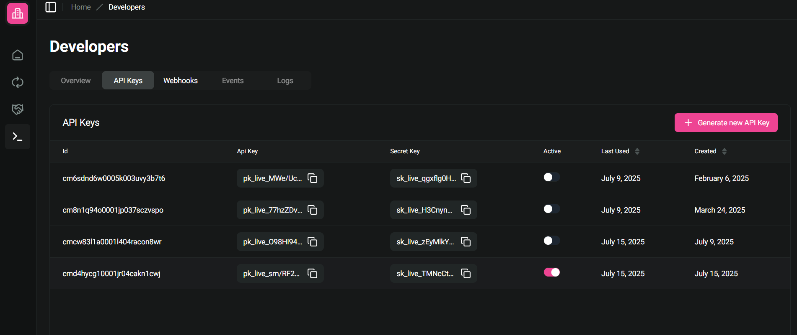

---
layout:
  width: default
  title:
    visible: false
  description:
    visible: false
  tableOfContents:
    visible: true
  outline:
    visible: true
  pagination:
    visible: true
  metadata:
    visible: true
---

# Developers

### Developers

In the [**Developer** tab](https://dashboard.coinvoyage.io/developers)  you can create, view, and rotate your **public API Key** and **Secret** securely to authenticate your integration.

<figure><figcaption></figcaption></figure>

You can also set up and manage **webhook endpoints** and subscribe to events like payment confirmations or disputes.

<figure><figcaption></figcaption></figure>

Check out [Webhook](../getting-started/webhooks/verify-webhook-request.md) for example
