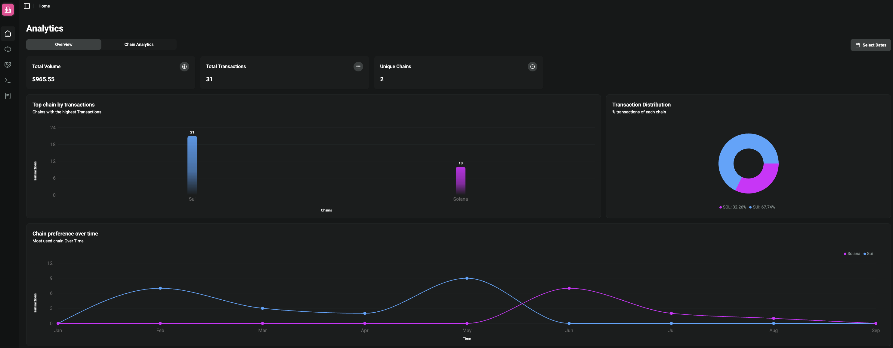
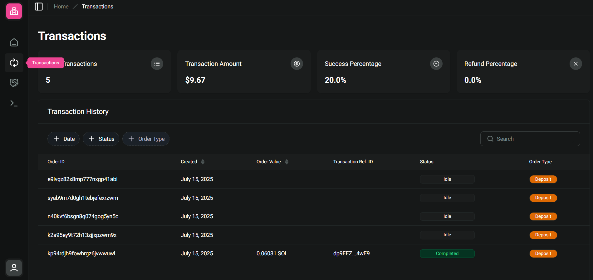
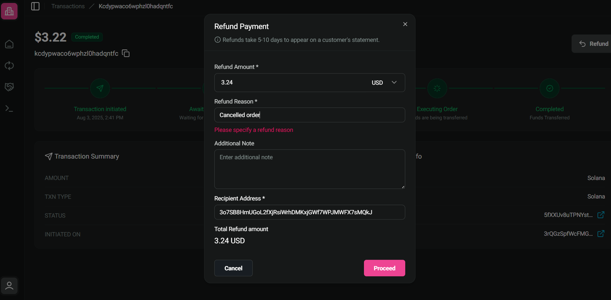
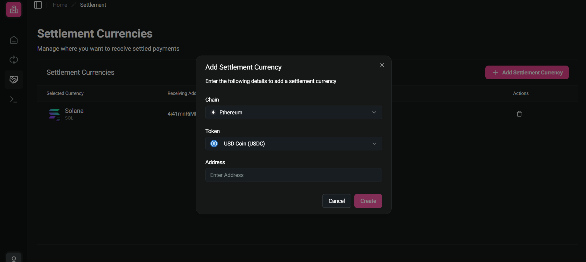
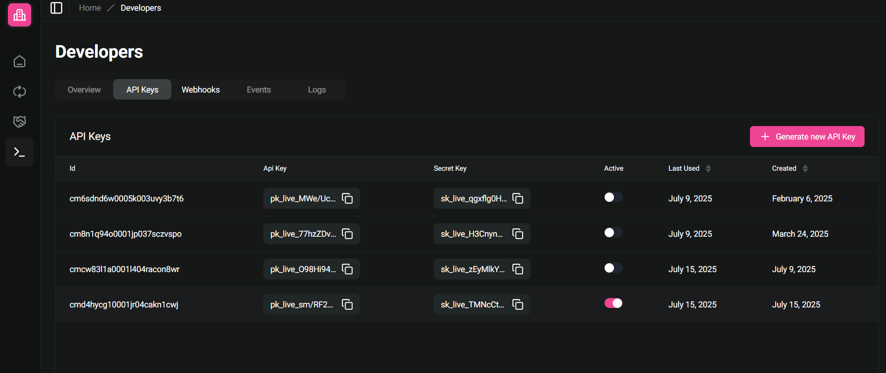
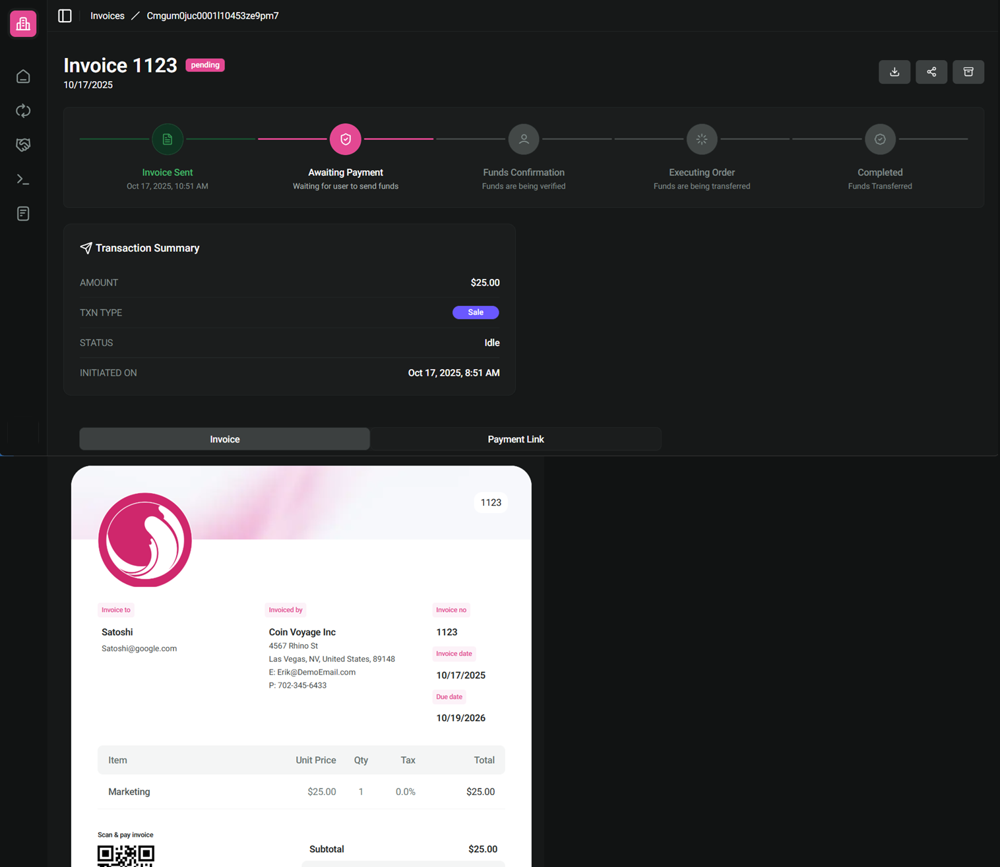
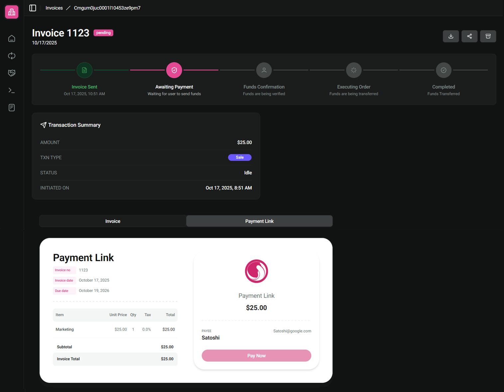

# Overview

### Introduction

The [CoinVoyage dashboard](https://dashboard.coinvoyage.io/) is the user interface where you manage and configure your account. You can use the Dashboard to navigate account analytics, search transaction, set preferred settlement currency and generate API keys.

### Analytics

CoinVoyage's analytics provides a real-time and historical view of your payment activity across all supported chains and tokens.

<figure><figcaption></figcaption></figure>

Through [analytics](https://dashboard.coinvoyage.io/) you can get an overview of your payment performance through key metrics and reports to help you track and analyze your payment performance. It includes total volume, payment method usage, conversation rate, customer preferences and trends, etc



### Transaction

The [**Transactions**](https://dashboard.coinvoyage.io/transactions) tab logs each crypto payment or settlement event processed via CoinVoyage.

<figure><figcaption></figcaption></figure>

* Use **search and filter** options to isolate specific transactions or orders.
* **Click any row** to view a full transaction detail page, including on-chain metadata, status, and associated hashes.
* The **top analytics summary** provides an overview of volume and activity trends.

Use this tab to monitor transaction flow, debug failed or pending payments, or confirm successful on-chain settlements.

#### Refunds

Refunds are initiated from the **Transaction Detail** view and executed as on-chain transactions tied to the original payment.

<figure><figcaption></figcaption></figure>

* From a completed transaction, click **“Refund”** to launch the refund modal.
*   **Inputs Required**:

    * `refund_amount`: Supports partial or full refund in the settlement currency.
    * `refund_reason`: Required string for internal tracking.
    * `note`: Optional field for additional context.
    * `recipient_address`: Target wallet for refund.

    After clicking **Proceed**, the CoinVoyage widget will open, allowing you to select the currency for the refund and confirm the transaction.

<figure><figcaption></figcaption></figure>

Once sent, refund status updates in real-time. All refund transactions are shown under the **“Refund Transactions”** section of the original payment.


Refunds are executed **as a new on-chain transfer** and recorded as a linked child transaction under the original.


#### Settlement Currencies

The [Settlement](https://dashboard.coinvoyage.io/settlement) tab lets you define which **currency your payouts will be settled in**, regardless of the crypto asset the user pays with.


* Settlement currency logic is only applied to `PayOrder`s with `mode = "SALE"`.
* For `mode = "DEPOSIT"`, the crypto asset is settled directly to the wallet specified in the `PayOrder` request.


<figure><figcaption></figcaption></figure>

When a payment is received in any supported cryptocurrency (e.g., BTC, ETH, SOL), CoinVoyage performs an automatic conversion and settlement to the configured asset and chain (e.g., USDT on Sol, ETH on Arbitrum).

Merchants can configure **multiple settlement currencies across different chains**. CoinVoyage optimizes settlement routing by selecting the path with the **best quote** (maximized output, minimized gas fees).

All settlements are non-custodial and executed on-chain.

#### Developers

In the [**Developer** tab](https://dashboard.coinvoyage.io/developers) you can create, view, and rotate your **public API Key** and **Secret** securely to authenticate your integration.

<figure><figcaption></figcaption></figure>

You can also set up and manage **webhook endpoints** and subscribe to events like payment confirmations or disputes.

<figure><figcaption></figcaption></figure>

Check out [Webhook](../getting-started/webhooks.md) for example

#### Invoices

CoinVoyage now supports **invoices**, allowing merchants to generate crypto payment requests directly from the dashboard. From the dashboard, you can create an invoice by entering the amount, currency, customer details, description and optionally setting a due date.

<figure><figcaption></figcaption></figure>

To get started, merchants first set up their **organization profile** in the dashboard, which defines their business details. Once the organization profile is configured, they can immediately begin creating invoices for their customers.

The customer automatically receives an email containing the invoice details and this payment link, making it easy for them to complete the transaction in their chosen cryptocurrency while the merchant receives settlement in their preferred currency.

<figure><figcaption></figcaption></figure>

**Payment Link preview**

<figure><figcaption></figcaption></figure>
