# Overview

### Introduction

The [CoinVoyage dashboard](https://dashboard.coinvoyage.io/) is the hub for managing payments, monitoring performance, and configuring your organization. It gives you a single place to review analytics, inspect transactions, manage settlement settings, withdraw to fiat, issue refunds, and configure developer tools.

In the dashboard, you can:

* **Analyze payments** in real time and over historical periods across supported chains and tokens.
* **Search and review transactions** with full on-chain metadata, activity summaries, and detailed reporting.
* **Initiate refunds** securely with full or partial amounts directly on-chain.
* **Configure settlement currencies** to automatically convert received payments into your preferred assets and chains.
* **Withdraw settlement balances** to a linked bank account.
* **Configure custom fees** that are charged to the user on top of the CoinVoyage platform fee.
* **Manage developer integrations**, including API key generation and webhook setup for payment confirmations or disputes.
* **Generate and send invoices** directly to customers, simplifying crypto payment collection.

### Analytics

CoinVoyage analytics provides a real-time and historical view of payment activity across supported chains and tokens.

<figure>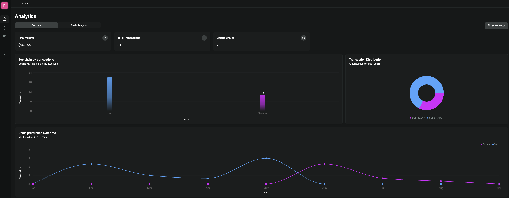<figcaption></figcaption></figure>

Use analytics to monitor payment performance through key metrics and reports, including total volume, payment method usage, conversion rate, customer preferences, and trends.

### Transaction

The [**Transactions**](https://dashboard.coinvoyage.io/transactions) tab logs each crypto payment or settlement event processed through CoinVoyage.

<figure>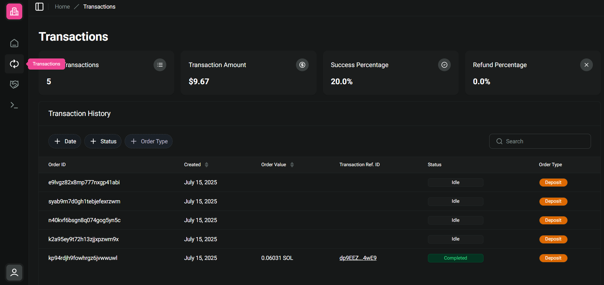<figcaption></figcaption></figure>

* Use **search and filter** options to isolate specific transactions or orders.
* **Click any row** to view a full transaction detail page, including on-chain metadata, status, and associated hashes.
* The **top analytics summary** provides an overview of volume and activity trends.

Use this tab to monitor transaction flow, debug failed or pending payments, and confirm successful on-chain settlements.

#### Refunds

Refunds are initiated from the **Transaction Detail** view and executed as on-chain transactions tied to the original payment.

<figure>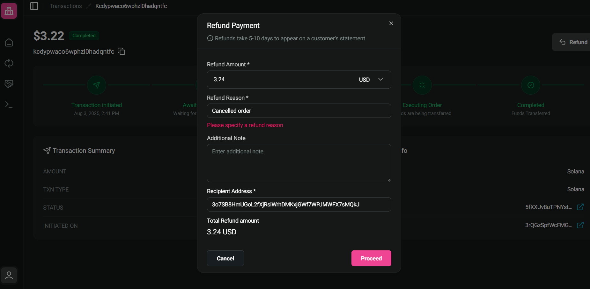<figcaption></figcaption></figure>

* From a completed transaction, click **"Refund"** to launch the refund modal.
* **Inputs required**:
  * `refund_amount`: Supports partial or full refunds in the settlement currency.
  * `refund_reason`: Required string for internal tracking.
  * `note`: Optional field for additional context.
  * `recipient_address`: Target wallet for the refund.

After clicking **Proceed**, the CoinVoyage widget opens so you can select the currency for the refund and confirm the transaction.

<figure>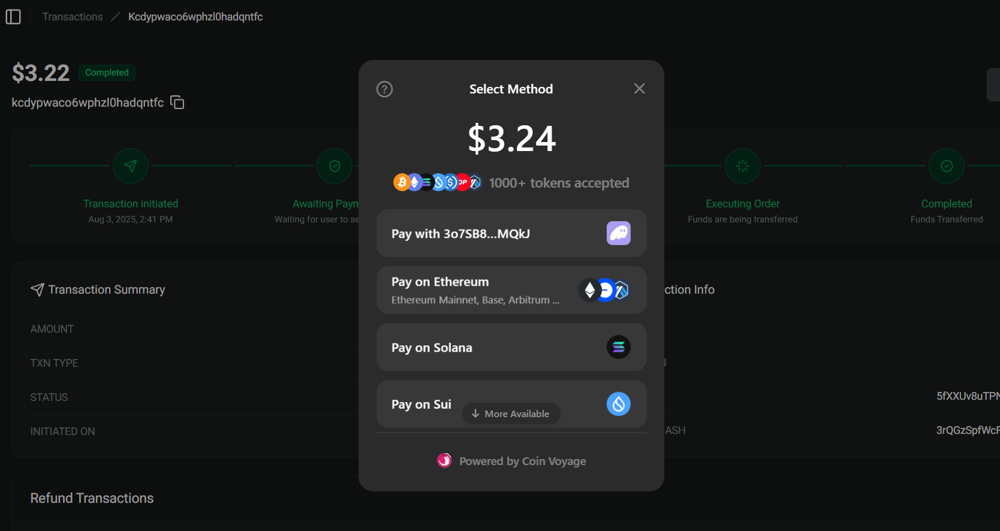<figcaption></figcaption></figure>

Once sent, refund status updates in real time. All refund transactions are shown under the **"Refund Transactions"** section of the original payment.


Refunds are executed as a new on-chain transfer and recorded as a linked child transaction under the original payment.


#### Settlement Currencies

The [Settlement](https://dashboard.coinvoyage.io/settlement) tab lets you define which currency your payouts will be settled in, regardless of the crypto asset the user pays with.


* Settlement currency logic is only applied to `PayOrder`s with `mode = "SALE"`.
* A `SALE` PayOrder without `intent.asset` requires at least one settlement currency configured here.
* If a `SALE` PayOrder includes `intent.asset`, that PayOrder settles to the specified asset and chain instead of using the dashboard default.
* For `mode = "DEPOSIT"`, the crypto asset is settled directly to the wallet specified in the `PayOrder` request.


<figure>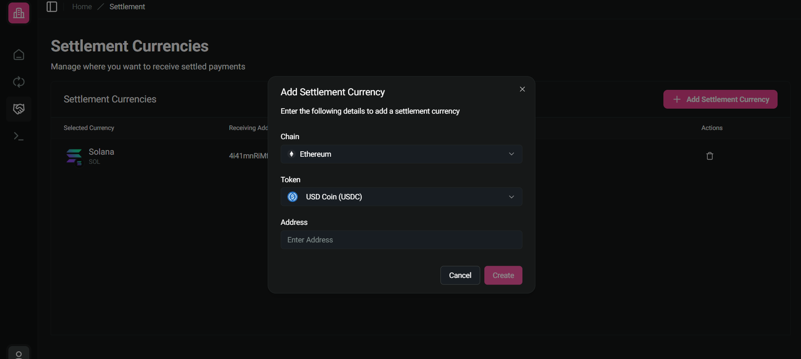<figcaption></figcaption></figure>

When a payment is received in any supported cryptocurrency such as BTC, ETH, or SOL, CoinVoyage can automatically convert and settle it to the configured asset and chain.

Merchants can configure multiple settlement currencies across different chains. CoinVoyage optimizes settlement routing by selecting the path with the best quote.

All settlements are non-custodial and executed on-chain.

#### Withdrawals

The **Withdrawals** flow lets you off-ramp supported settlement balances to a linked bank account.

<figure>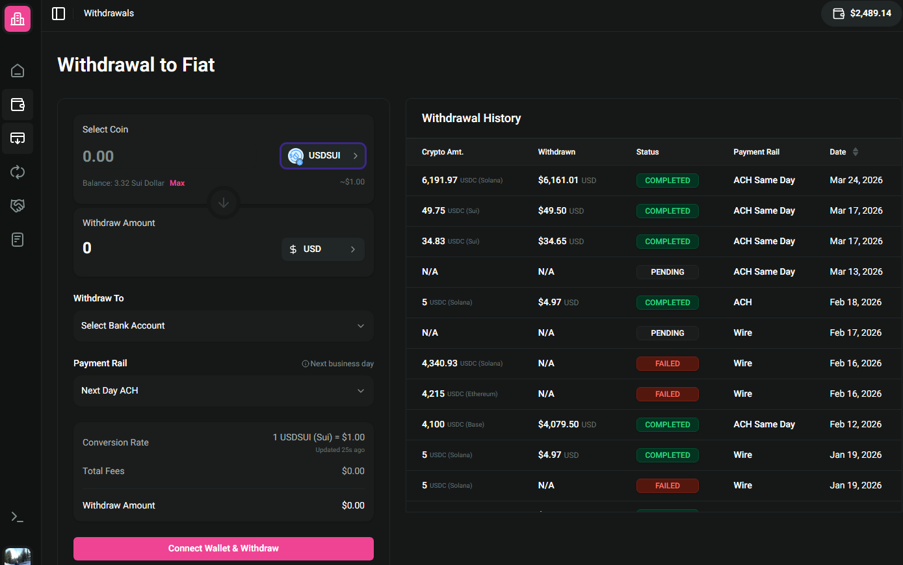<figcaption></figcaption></figure>

To complete a withdrawal:

1. Complete **KYC** or **KYB** for your organization.
2. Add and verify a **bank account**.
3. Select the **coin** you want to withdraw and the destination **bank account**.
4. Connect your wallet and confirm the off-ramp transaction.


Only coins that are already configured as **settlement currencies** are shown as withdrawal options.


The withdrawals view also includes a history table so you can track status, payment rail, withdrawn amount, and completion date for each fiat payout.

#### Custom Fees

Under **Organization Settings**, you can set a custom fee that is charged to the user on top of the CoinVoyage platform fee.

<figure>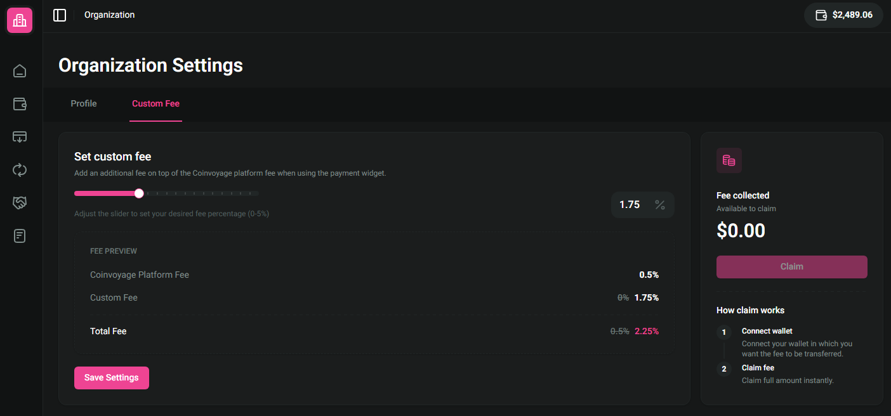<figcaption></figcaption></figure>

Use this setting to define the additional fee percentage your organization wants to collect when customers complete a payment through CoinVoyage.


Custom fees accrue over time and can be claimed in **USDC** on **EVM**, **Sui**, and **Solana**.


To use custom fees:

1. Open **Organization Settings** and go to the **Custom Fee** tab.
2. Set the additional fee percentage you want to charge.
3. Save the setting so it is applied on top of the CoinVoyage platform fee.
4. When fees have accrued, connect the wallet where you want to receive the funds and claim them.

#### Developers

In the [**Developers** tab](https://dashboard.coinvoyage.io/developers), you can create, view, and rotate your **public API Key** and **Secret** to authenticate your integration.

<figure>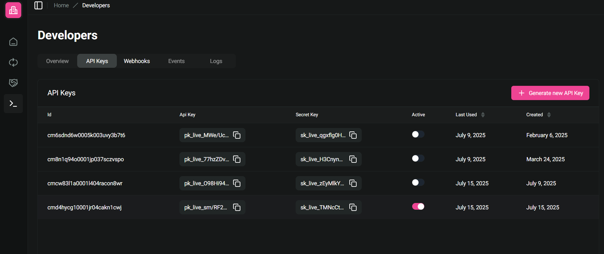<figcaption></figcaption></figure>

You can also set up and manage **webhook endpoints** and subscribe to events like payment confirmations or disputes.

<figure>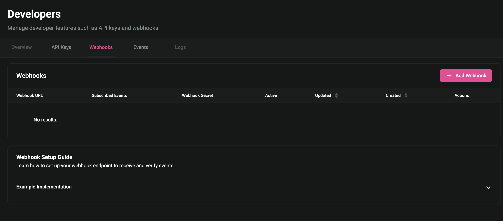<figcaption></figcaption></figure>

See [Webhooks](../overview/webhooks.md) for an implementation example.

#### Invoices

CoinVoyage supports **invoices**, allowing merchants to generate crypto payment requests directly from the dashboard. From the dashboard, you can create an invoice by entering the amount, currency, customer details, description, and optionally a due date.

<figure>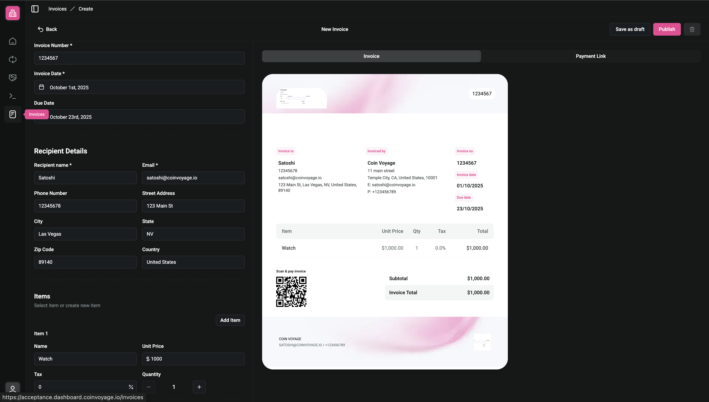<figcaption></figcaption></figure>

To get started, merchants first configure their **organization profile** in the dashboard. Once the organization profile is ready, they can immediately begin creating invoices for customers.

The customer receives an email containing the invoice details and payment link, making it easy to complete the transaction in their chosen cryptocurrency while the merchant receives settlement in their preferred currency.

<figure>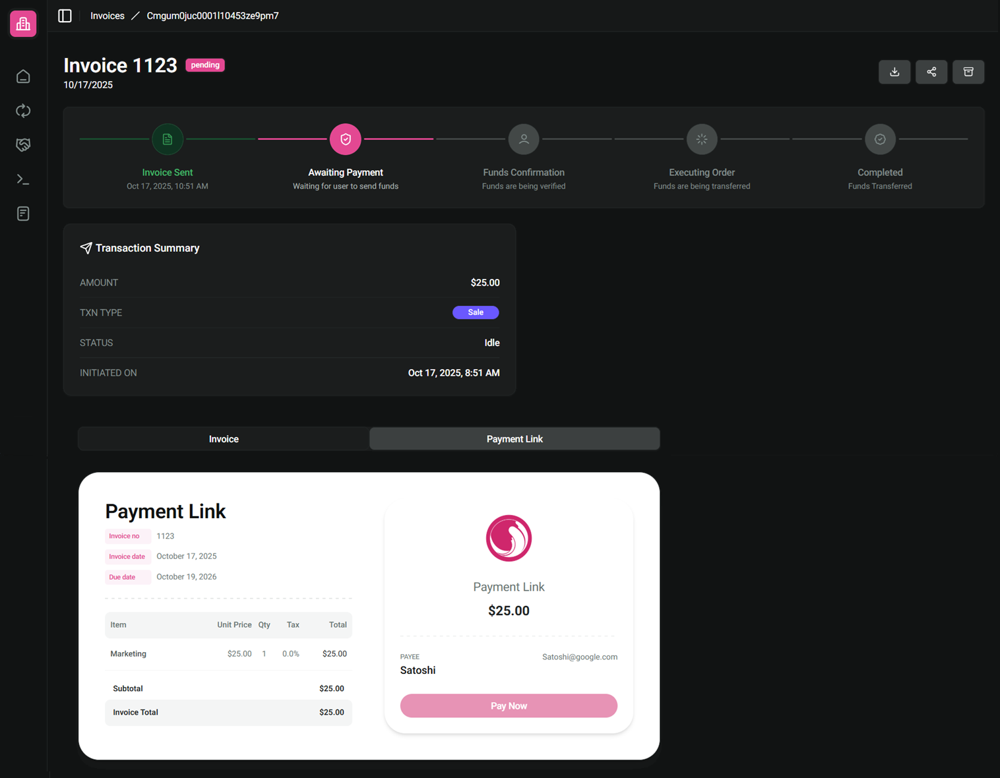<figcaption></figcaption></figure>
