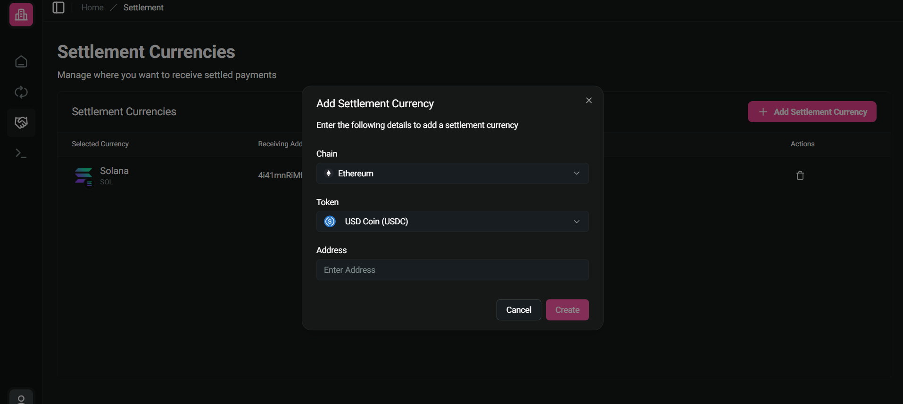

---
layout:
  width: default
  title:
    visible: false
  description:
    visible: false
  tableOfContents:
    visible: true
  outline:
    visible: true
  pagination:
    visible: true
  metadata:
    visible: true
---

# Settlement Currency

### Settlement Currency

The [Settlement](https://dashboard.coinvoyage.io/settlement) tab lets you define which **currency your payouts will be settled in**, regardless of the crypto asset the user pays with.


* Settlement currency logic is only applied to `PayOrder`s with `mode = "SALE"`.
* For `mode = "DEPOSIT"`, the crypto asset is settled directly to the wallet specified in the `PayOrder` request.


<figure><figcaption></figcaption></figure>

When a payment is received in any supported cryptocurrency (e.g., BTC, ETH, SOL), CoinVoyage performs an automatic conversion and settlement to the configured asset and chain (e.g., USDT on Sol, ETH on Arbitrum).

Merchants can configure **multiple settlement currencies across different chains**. CoinVoyage optimizes settlement routing by selecting the path with the **best quote** (maximized output, minimized gas fees).

All settlements are non-custodial and executed on-chain.
