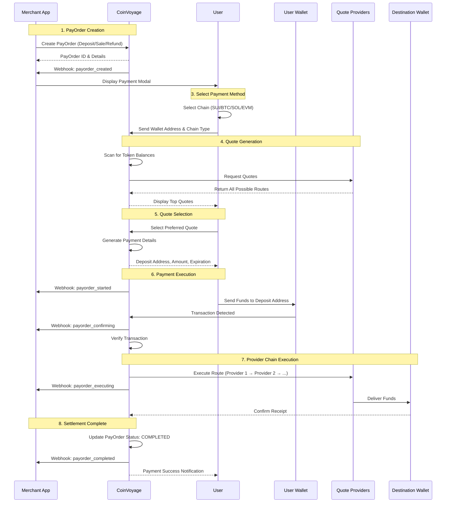

# How It Works

### PayOrder Flow Overview

CoinVoyage enables seamless cross-chain payments by orchestrating multiple providers and optimizing routes to deliver the best exchange rates and lowest fees for users.

---

### End-to-End Payment Flow



---

### Detailed Flow Steps

#### 1. PayOrder Creation

The merchant or organization creates a PayOrder through `@coin-voyage/paykit` `ApiClient` or directly via the API:

- **Deposit**: User deposits funds to a specific wallet address
- **Sale**: Merchant creates an order that settles to their wallet
- **Refund**: Merchant initiates a refund for a previous payment

```typescript
const payOrder = await apiClient.createDepositPayOrder({
  destination_currency: {
    address: null, // null for native token
    chain_id: ChainId.SUI,
  },
  receiving_address: "0xYourWalletAddress",
  destination_amount: "10",
});
```

---

#### 2. Payment Method Selection

The user opens the payment modal and selects their preferred payment method:

- **SUI** - Sui blockchain
- **BTC** - Bitcoin
- **SOL** - Solana
- **EVM** - Ethereum, Arbitrum, Base, Optimism, Polygon, BSC, etc.

---

#### 3. Quote Generation

CoinVoyage generates quotes by:

1. **Scanning wallet balances** - Identifies available tokens in the user\'s wallet
2. **Querying providers** - Requests quotes from multiple liquidity sources:
   - **AMMs** - Uniswap, Jupiter, Cetus, etc.
   - **CCTP** - Cross-chain USDC transfers
   - **ChangeNow** - Cross-chain exchange aggregator
   - **Direct Transfer** - Same-chain native transfers
   - **More** to be added soon
3. **Route optimization** - Can chain providers together for optimal rates
4. **Quote ranking** - Sorts quotes by best price (highest output, lowest fees)

---

#### 4. Quote Selection & Payment Details

The user sees the best available quotes and selects their preferred option:

**Quote Example:**

```
Pay: 0.05 ETH (Ethereum)
Receive: 10 SUI (Sui Network)
Route: Ethereum → CCTP → Sui
Fee: 1.5%
Estimated time: ~30 seconds
```

Once selected, the system generates:

- **Deposit address** - Unique address for this payment
- **Exact amount** - Precise amount to send
- **Expiration time** - Payment window (typically 30 minutes)
- **Refund address** - Where funds go if payment fails

---

#### 5. User Payment

The user sends funds from their wallet to the provided deposit address. CoinVoyage monitors the blockchain for:

- **Transaction submission** - Payment initiated
- **Confirmation** - Transaction confirmed on-chain
- **Amount verification** - Ensures correct amount received

---

#### 6. Backend Execution

Once payment is confirmed, the CoinVoyage backend executes the flow:

**Single Provider Flow**

```
User Payment → Provider → Destination
Example: SOL → Direct Transfer → SOL (same chain)
```

**Multi-Provider Chain**

```
User Payment → Provider 1 → Provider 2 → Destination
Example: ETH → Uniswap (ETH→USDC) → CCTP → SUI
```

The system handles:

- **Route execution** - Processes through each provider in sequence
- **Error handling** - Automatically refunds if any step fails
- **Status updates** - Real-time webhook notifications

---

#### 7. Settlement & Completion

Upon successful execution:

1. Funds arrive at the destination address
2. PayOrder status updates to `COMPLETED`
3. Webhook event sent: `payorder_completed`
4. Transaction hashes recorded on-chain

If any step fails:

1. Automatic refund initiated
2. Funds returned to user's refund address
3. PayOrder status updates to `REFUNDED`
4. Webhook event sent: `ORDER_REFUNDED`

---

### Provider Chaining Example

CoinVoyage can chain multiple providers to achieve the best rate:

**Example: Pay with ETH on Ethereum, receive SUI**

```
Step 1: User pays ETH on Ethereum
   ↓
Step 2: Uniswap swaps ETH → USDC (on Ethereum)
   ↓
Step 3: CCTP transfers USDC from Ethereum → Sui
   ↓
Step 4: Sui DEX swaps USDC → SUI
   ↓
Step 5: SUI delivered to merchant wallet
```

The entire process is:

- **Automated** - No manual intervention required
- **Optimized** - Best route calculated in real-time
- **Transparent** - All fees and routes shown upfront
- **Fast** - Typically completes in under 60 seconds

---

### Learn More

- [SDK Reference](sdk-reference.md) - Integrate payments into your app
- [Webhooks](webhooks.md) - Receive real-time payment updates
- [Supported Networks](supported-networks.md) - View all supported chains
- [Dashboard](../dashboard/index.md) - Monitor payments in real-time
