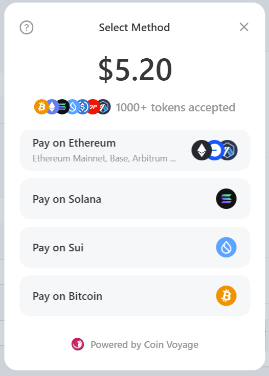

# SDK Reference

The [`@coin-voyage/paykit`](https://www.npmjs.com/package/@coin-voyage/paykit) SDK offers client-side and server-side functionality that abstracts the integration of the API, while also exporting UI components. This SDK reduce the amount of boilerplate code you need and lets you easily integrate payment and deposit flow into your web application.

***

#### Install CoinVoyage PayKit

Use your preferred package manager to install CoinVoyage PayKit.

### npm
```sh
npm i @coin-voyage/paykit @tanstack/react-query@^5.90.6
```

### pnpm
```sh
pnpm add @coin-voyage/paykit @tanstack/react-query@^5.90.6
```

### yarn
```sh
yarn add @coin-voyage/paykit @tanstack/react-query@^5.90.6
```

### bun
```sh
bun add @coin-voyage/paykit @tanstack/react-query@^5.90.6
```

#### PayKitProvider

The `PayKitProvider` is required if you want to utilize the [PayButton](sdk-reference.md#paybutton) and [usePayStatus](sdk-reference.md#usepaystatus). It wraps the client application and tracks the state of the PayOrder flow.

```tsx
"use client";

import { PayKitProvider, WalletProvider } from "@coin-voyage/paykit";
import { QueryClient, QueryClientProvider } from "@tanstack/react-query";

const queryClient = new QueryClient();

export function Providers({ children }: { children: React.ReactNode }) {
  return (
    <QueryClientProvider client={queryClient}>
      <WalletProvider>
        <PayKitProvider
          apiKey={process.env.NEXT_PUBLIC_COIN_VOYAGE_API_KEY!}
          debugMode={true}
          mode="light"
          onConnect={({ address, chainId, connectorId, type }) => {
            console.log(
              `Connected to ${chainId} with ${connectorId} (${type}) at ${address}`
            );
          }}
          environment="production"
        >
          {children}
        </PayKitProvider>
      </WalletProvider>
    </QueryClientProvider>
  );
}
```

**PayKitProvider Configuration Options**

The `PayKitProvider` lets you configure the theme, style, and behavior of the `PayModal`. The `PayModal` guides the user through the payment process and opens when the user interacts with the `PayButton`.



The `PayKitProvider` accepts the following configuration parameters:


| Option | Required? | Description |
| --- | --- | --- |
| `apiKey` | Yes | API Key of the organization, acquired in the developers tab of the dashboard. |
| `customTheme` | No | Gives you the flexibility to modify the PayKit modal styling. See also Themes & customisation |
| `environment` | No | Environment to connect to:production (default); development; The development environment exposes additional testnet chains. |
| `debugMode` | No | Will log debug logs into the console, helpful when integrating. |
| `mode` | No | "light", "dark" or "auto" |
| `onConnect` | No | Callback triggered upon connection of a new wallet. |
| `onConnectValidation` | No | Allows you to pass a custom function that is run upon connecting of a wallet. |
| `onDisconnect` | No | Callback triggered upon disconnect of a wallet. |
| `options` | No | Global `PayKitOptions` applied across all pay buttons and payment flows. Includes language, CTA visibility, overlay behavior, optimistic confirmation, and experimental feature flags such as `experimentalFeatures.cardPayments`. |
| `theme` | No | Select a predefined styling for the PayKit modal, options include:auto; web95; retro; soft; midnight; minimal; rounded; nouns |


**PayKitProvider `options` (`PayKitOptions`)**

Use `options` to configure global behavior across all PayButtons and payment flows managed by the provider.

```typescript
type PayKitOptions = {
  language?: Languages
  hideTooltips?: boolean
  hideQuestionMarkCTA?: boolean
  hideNoWalletCTA?: boolean
  hideRecentBadge?: boolean
  walletConnectCTA?: "link" | "modal" | "both"
  embedGoogleFonts?: boolean
  disclaimer?: ReactNode | string
  bufferPolyfill?: boolean
  overlayBlur?: number
  optimisticConfirmation?: boolean
  experimentalFeatures?: {
    cardPayments?: boolean
  }
}
```

Key options:

* `language`: Sets the PayKit display language.
* `hideTooltips`, `hideQuestionMarkCTA`, `hideNoWalletCTA`, `hideRecentBadge`: Hide specific helper UI and CTA elements.
* `walletConnectCTA`: Controls whether WalletConnect is shown as a deep link, modal, or both.
* `embedGoogleFonts`: Automatically embeds the Google Font for the selected built-in theme. This does not work with custom themes.
* `disclaimer`: Adds a global disclaimer to the modal. Accepts a string or `ReactNode`.
* `bufferPolyfill`: Enables the Buffer polyfill for bundlers that do not provide Node polyfills by default. Defaults to `true`.
* `overlayBlur`: Applies background blur while the modal is open.
* `optimisticConfirmation`: Enables optimistic order confirmation after the user signs and the transaction validates on-chain. This is not allowed for deposits and defaults to `true`.
* `experimentalFeatures`: Container for opt-in feature flags that are not enabled by default.
* `experimentalFeatures.cardPayments`: Enables card payments. Disabled by default while CoinVoyage gathers more feedback and data. Your organization must also be approved before you can use it.

#### WalletProvider

The `WalletProvider` wraps the `PayKitProvider` , and is required if you want to utilize the [PayButton](sdk-reference.md#paybutton) and [usePayStatus](sdk-reference.md#usepaystatus). It facilitates the configuration of specific chain types, such as setting a specific `rpcUrl` or adding additional wallet connectors.

```tsx
"use client"

import { PayKitProvider, WalletProvider } from "@coin-voyage/paykit"
import { QueryClient, QueryClientProvider } from "@tanstack/react-query"

const queryClient = new QueryClient()

export function Providers({ children }: { children: React.ReactNode }) {
  return (
    <QueryClientProvider client={queryClient}>
      <WalletProvider config={{
          evm: {
            coinbase: {
              appName: "My App"
            },
            walletConnect: {
              projectId: "your-project-id",
            }
          },
          solana: {
            rpcUrl: "my-solana-rpc-url",
            walletConfiguration: {
              wallets: [customWalletAdapter()],
            }
          },
          utxo: {
            lazy: true
          },
        }}
      >
        <PayKitProvider apiKey={process.env.NEXT_PUBLIC_COIN_VOYAGE_API_KEY!}>
          {children}
        </PayKitProvider>
      </WalletProvider>
    </QueryClientProvider>
  )
}
```

**WalletProvider Configuration Options**

The `WalletProvider` accepts the following configuration parameters:


| Option | Required? | Description |
| --- | --- | --- |
| `config` | No | Object that contains chain type specific configurations. |
| `config.evm` | No | Configuration for EVM chain types. Allows configuration of wallets, connectors, and other evm specific properties. Also includes options to configure `WalletConnect`, `Coinbase Wallet` and `MetaMask` |
| `config.solana` | No | Configuration of the Solana chain. Set a custom `rpcUrl` and configure wallet adapters. |
| `config.sui` | No | Configuration of the Sui chain. Set a custom `rpcUrl` and configure wallet adapters. |
| `config.utxo` | No | Configuration of UTXO chain types. Allows configuration of wallet connectors and few additional options. |


#### PayButton

UI component you can add to your application. The button comes in multiple themes and its style is customizable to your branding.

Clicking the button opens a modal that allows the user to select a payment methods in order to complete the pay order.

.png)

```tsx
<PayButton
    intent="Deposit"
    toAddress={"0xYourWalletToDepositInto"}
    toAmount={100}
    toChain={ChainId.ETH}
    toToken={"0xa0b86991c6218b36c1d19d4a2e9eb0ce3606eb48"} // USDC
    
    mode="auto"
    style={{
       backgroundColor: "#CF276B",
       color: "white",
    }}
    onClose={() => {
       console.log("Modal Closed")
    }}
    onOpen={() => {
       console.log("Modal Opened")
    }}
    closeOnSuccess={true}

    onPaymentCreationError={(event) => {
       console.log(event.errorMessage)
    }}
    onPaymentBounced={() => {
       console.error("Payment Bounced")
    }}
    onPaymentStarted={() => {
       console.log("Payment Started", {
         description: "Your payment is being processed.",
       })
    }}
    onPaymentCompleted={() => {
       console.log("Payment Complete", {
         description: "Your payment was successful.",
       })
    }}
/>
```

**PayButton Configuration Options**

The `PayButton` accepts the following configuration parameters:


| Option | Required? | Description |
| --- | --- | --- |
| `payId` | Conditional* | The payment ID, generated via the Coin Voyage API. Replaces the deposit parameters below. Use this to display a pay order created on the **server**, like a `SALE` pay order. |
| `toChain` | Conditional* | Destination chain ID. The chain to deposit to. |
| `toToken` | No | The destination token to receive. Specify the contract address of the token (ERC-20/SPL/...). Omitting (`undefined`) indicates the native token (ETH/SOL/SUI/...). |
| `toAmount` | Conditional* | The amount of destination token to receive. |
| `toAddress` | Conditional* | The recipient of the deposit. Must be an address on the `toChain`. |
| `metadata` | No | Metadata to attach to the deposit. |
| `intent` | No | The intent verb displayed on the button, such as "Pay", "Deposit", or "Purchase". |
| `onPaymentCreationError` | No | Callback triggered when invalid properties are used to create a deposit payOrder. |
| `onPaymentStarted` | No | Callback triggered when user sends payment and transaction is seen on chain. |
| `onPaymentCompleted` | No | Callback triggered when destination transfer or call completes successfully. |
| `onPaymentBounced` | No | Callback triggered when destination call reverts and funds are refunded. |
| `onOpen` | No | Callback triggered when the modal is opened. |
| `onClose` | No | Callback triggered when the modal is closed. |
| `defaultOpen` | No | Open the modal by default on component mount. |
| `mode` | No | Visual appearance mode: "light", "dark", or "auto". |
| `theme` | No | Named theme preset. See Themes & customization for available options. |
| `customTheme` | No | Custom theme object for advanced styling. See Themes & customization for details. |


> [!NOTE]
**\*Required Parameters:** Either provide `payId` **OR** all three of `toAddress`, `toChain`, and `toAmount`. The `payId` approach is used for server-generated pay orders, while the direct parameters are used for client-side deposit flows.

#### PayButton.Custom

For advanced use cases where you need complete control over the button's appearance and behavior, use `PayButton.Custom`. This component provides a render prop pattern that gives you access to `show()` and `hide()` functions to control the payment modal.

**Usage**

```tsx
<PayButton.Custom
  payId={payId}
  onPaymentStarted={(event) => {
    console.log("Payment started", event);
  }}
  onPaymentCompleted={(event) => {
    console.log("Payment completed", event);
  }}
>
  {({ show, hide }) => (
    <button
      onClick={show}
      className="w-full rounded-md border border-transparent bg-indigo-600 px-4 py-3 text-base font-medium text-white shadow-sm hover:bg-indigo-700 focus:outline-none focus:ring-2 focus:ring-indigo-500 focus:ring-offset-2 focus:ring-offset-gray-50"
    >
      Pay With Crypto
    </button>
  )}
</PayButton.Custom>
```

**PayButton.Custom Configuration Options**

The `PayButton.Custom` component accepts all the same configuration parameters as `PayButton` (payment props, callbacks, etc.), except for the styling options. Instead of `style`, `mode`, `theme`, `customTheme`, and `disabled`, it provides a `children` render prop:


| Option | Required? | Description |
| --- | --- | --- |
| `children` | Yes | A render function that receives `show` and `hide` functions to control the modal. |
| `payId` | Conditional* | The payment ID, generated via the Coin Voyage API. |
| `toChain` | Conditional* | Destination chain ID. |
| `toToken` | No | The destination token contract address or `undefined` for native token. |
| `toAmount` | Conditional* | The amount of destination token to receive. |
| `toAddress` | Conditional* | The recipient address on the destination chain. |
| `metadata` | No | Metadata to attach to the payment. |
| `intent` | No | The intent verb (not displayed on custom button). |
| `onPaymentCreationError` | No | Callback triggered when payment creation fails. |
| `onPaymentStarted` | No | Callback triggered when payment transaction is detected. |
| `onPaymentCompleted` | No | Callback triggered when payment completes successfully. |
| `onPaymentBounced` | No | Callback triggered when payment fails and is refunded. |
| `onOpen` | No | Callback triggered when modal opens. |
| `onClose` | No | Callback triggered when modal closes. |
| `defaultOpen` | No | Open the modal by default on mount. |


**Render Props**

The `children` function receives an object with the following functions:

| Function | Description                                                                     |
| -------- | ------------------------------------------------------------------------------- |
| `show()` | Opens the payment modal. Call this from your custom button's `onClick` handler. |
| `hide()` | Closes the payment modal programmatically.                                      |

> [!NOTE]
**When to use PayButton.Custom:**

* You need complete control over button styling beyond CSS customization
* You want to integrate the payment modal into an existing design system
* You need to trigger the modal from multiple UI elements
* You want to programmatically control modal visibility

#### ApiClient

The API client is the easiest way to interact with the CoinVoyage backend. It allows you to safely create PayOrders on the server and perform various payment-related operations.

**Initialization**

```tsx
import { ApiClient } from "@coin-voyage/paykit/server";

const apiClient = new ApiClient({
  apiKey: process.env.COIN_VOYAGE_API_KEY!,
  environment: "production",
  sessionId: "optional-session-id",
  version: "1.0.0",
});
```

**Configuration Options**


| Option | Required? | Description |
| --- | --- | --- |
| `apiKey` | Yes | API Key of the organization, acquired in the developers tab of the dashboard. |
| `environment` | No | Environment to connect to: `production` (default) or `development`. |
| `sessionId` | No | Optional session identifier for request tracking. |
| `version` | No | Optional client version string sent via `X-Client-Version` header. |


**Common Request Options**

Most authenticated helper methods also accept an optional `opts` argument for custom headers:

```typescript
type Opts = {
  headers?: Record<string, string>
}
```

***

**API Response Structure**

All ApiClient methods return responses wrapped in an `APIResponse&lt;T&gt;` object that provides consistent error handling:

```tsx
interface APIResponse<T> {
  data?: T
  error?: {
    path: string
    statusCode: number
    status: string
    message: string
  }
}
```

**Usage Pattern:**

```tsx
const { data, error } = await apiClient.someMethod();

if (error) {
  console.error("Operation failed:", error.message);
  // Handle error case
  return;
}

// Use data safely - TypeScript knows it's defined
console.log("Success:", data);
```

This pattern ensures you always handle both success and error cases explicitly, and TypeScript can properly type-check your code.

***

**ApiClient Methods**

The API client exposes the following methods to interact with the backend:

***

**`getPayOrder`**

Fetches a PayOrder by its ID. Retrieves a PayOrder object from the API using the provided payOrderId.

```tsx
const { data: payOrder, error } = await apiClient.getPayOrder(
  "pay-order-id-123"
);
```

**Parameters:**

* `payOrderId` (string): The unique identifier of the PayOrder.

**Returns:** `Promise&lt;APIResponse&lt;PayOrder&gt;&gt;` - The PayOrder object wrapped in an API response.

**Response Structure:**

```typescript
// Successful response
{ data: PayOrder }

// Error response
{
  error: {
    path: string,
    statusCode: number,
    status: string,
    message: string
  }
}
```

***

**`generateAuthorizationSignature`**

Generates an authorization signature for API requests that require enhanced security. This signature is required for creating `SALE` and `REFUND` PayOrders.

> [!WARNING]
**Security Warning:** This function should only be run on the server. It uses the API secret, which must remain confidential. Never expose your API secret in client-side code.

```tsx
const apiSecret = process.env.COIN_VOYAGE_API_SECRET!;
const signature = apiClient.generateAuthorizationSignature(apiSecret, 'POST', '/pay-orders');
```

The signature is an HMAC-SHA256 hash computed over: `method + path + timestamp`, using the API secret as the HMAC key. The result is formatted as:

```
APIKey=<apiKey>,signature=<signature>,timestamp=<timestamp>
```

**Parameters:**

* `apiSecret` (string): The API secret obtained from the [dashboard](https://dashboard.coinvoyage.io/developers).
* `method` (string): The HTTP method (e.g., "POST", "GET").
* `path` (string): The request path (e.g., "/pay-orders").

**Returns:** `string` - A formatted authorization string.

***

**`createDepositPayOrder`**

Creates a PayOrder with mode `DEPOSIT`. This is used for direct deposits to a specified address on a target chain.

```tsx
import { ApiClient, ChainId } from "@coin-voyage/paykit/server";

const { data, error } = await apiClient.createDepositPayOrder({
  intent: {
    asset: {
      chain_id: ChainId.SUI,
      address: null, // null for native token (SUI)
    },
    amount: {
      token_amount: 10, // 10 SUI
    },
    receiving_address: "0xYourReceivingAddressHere",
  },
  metadata: {
    items: [{ name: "Deposit to SUI wallet" }],
  },
});
```

**Parameters:**

* `params` (PayOrderParams): Parameters required to create a deposit PayOrder
  * `intent` (PayOrderIntent): The intent of the order
    * `asset` (optional): Desired fulfillment asset with `chain_id` and `address` (null for native token)
    * `amount` (IntentAmount): Amount expected to fulfill the order
      * `token_amount` (optional): Token amount in human-readable format (e.g., 10 for 10 tokens)
      * `fiat` (optional): Fiat amount with `amount` and `unit` (e.g., "USD")
    * `receiving_address` (optional): Address to fulfill the order to. If not provided, a settlement address will be selected.
  * `metadata` (optional): Additional metadata for the PayOrder
* `opts` (optional): Additional request options such as custom headers

**Returns:** `Promise&lt;APIResponse&lt;PayOrder&gt;&gt;` - The created PayOrder object wrapped in an API response.

> [!WARNING]
**Amount validation:** You must provide either `token_amount` OR `fiat`, but not both. The amount must be greater than zero.

**Built-in Validation:** The method automatically validates input parameters using Zod schemas. If validation fails, it returns an error response without making the API call:

```typescript
// Invalid input example - both amounts provided
const { error } = await apiClient.createDepositPayOrder({
  intent: {
    amount: {
      token_amount: 10,
      fiat: { amount: 100, unit: "USD" }, // Error: only one allowed
    },
  },
});
// Returns: { error: { statusCode: 400, message: "Only one of fiat amount or token amount should be present." } }
```

***

**`createSalePayOrder`**

Creates a PayOrder with mode `SALE`. This is used for merchant sales. If you omit `intent.asset`, CoinVoyage settles the payment to a settlement currency configured in the dashboard. If you provide `intent.asset`, the PayOrder settles to that specific asset and chain instead.

> [!NOTE]
This method requires an API secret for authorization. The signature is generated internally using `generateAuthorizationSignature`.

| `SALE` request shape    | Settlement behavior                                        | Requirement                                                          |
| ----------------------- | ---------------------------------------------------------- | -------------------------------------------------------------------- |
| `intent.asset` omitted  | Settles to your dashboard settlement currency              | You must configure at least one settlement currency in the dashboard |
| `intent.asset` provided | Settles to the specified asset and chain for this PayOrder | Dashboard settlement currency is optional for that PayOrder          |

Example using the dashboard settlement currency:

```tsx
const apiSecret = process.env.COIN_VOYAGE_API_SECRET!;

const { data, error } = await apiClient.createSalePayOrder(
  {
    intent: {
      amount: {
        fiat: {
          amount: 200,
          unit: "USD",
        },
      },
    },
    metadata: {
      items: [
        {
          name: "t-shirt",
          description: "A nice t-shirt",
          image: "https://example.com/tshirt.jpg",
          quantity: 1,
          unit_price: 200,
          currency: "USD",
        },
      ],
    },
  },
  apiSecret
);
```

Example settling to a specific asset:

```tsx
const apiSecret = process.env.COIN_VOYAGE_API_SECRET!;

const { data, error } = await apiClient.createSalePayOrder(
  {
    intent: {
      amount: {
        fiat: {
          amount: 570.52,
          unit: "USD",
        },
      },
      asset: {
        chain_id: 30000000000001,
        address: "EPjFWdd5AufqSSqeM2qN1xzybapC8G4wEGGkZwyTDt1v",
      },
    },
  },
  apiSecret
);
```

**Parameters:**

* `params` (PayOrderParams): Parameters required to create a sale PayOrder
  * `intent` (PayOrderIntent): The intent of the order
    * `asset` (optional): Desired fulfillment asset with `chain_id` and `address` (null for native token). If omitted, CoinVoyage uses your configured settlement currency for `SALE` PayOrders.
    * `amount` (IntentAmount): Amount expected to fulfill the order
    * `receiving_address` (optional): Address to fulfill the order to. If not provided, a settlement address will be selected for the chosen asset or settlement currency.
  * `metadata` (optional): Additional metadata for the PayOrder
* `apiSecret` (string): API secret used to generate the authorization signature
* `opts` (optional): Additional request options such as custom headers

**Returns:** `Promise&lt;APIResponse&lt;PayOrder&gt;&gt;` - The created PayOrder object wrapped in an API response.

***

**`createRefundPayOrder`**

Creates a PayOrder with mode `REFUND` for an existing PayOrder. This allows merchants to refund full or partial payments.

> [!NOTE]
This method requires an API secret for authorization. The signature is generated internally using `generateAuthorizationSignature`.

```tsx
const apiSecret = process.env.COIN_VOYAGE_API_SECRET!;

const { data: refundPayOrder, error } = await apiClient.createRefundPayOrder(
  "original-payorder-id",
  {
    intent: {
      asset: {
        chain_id: 1,
        address: null,
      },
      receiving_address: "0x5678...efgh",
      amount: {
        fiat: {
          amount: 100,
          unit: "USD",
        },
      },
    },
    metadata: {
      items: [
        {
          name: "refund",
          description: "Refund for t-shirt purchase",
          unit_price: 100,
          currency: "USD",
        },
      ],
    },
  },
  apiSecret
);
```

**Parameters:**

* `payOrderId` (string): The unique identifier of the PayOrder to be refunded
* `params` (PayOrderParams): Parameters for the refund
  * `intent` (PayOrderIntent): The refund intent with amount
  * `metadata` (optional): Additional metadata including refund details
* `apiSecret` (string): API secret used to generate the authorization signature
* `opts` (optional): Additional request options such as custom headers

**Returns:** `Promise&lt;APIResponse&lt;PayOrder&gt;&gt;` - Response object containing either the PayOrder data or error information.

***

**`createPayOrder`**

Low-level helper for creating a PayOrder with an explicit `mode`. In most cases you should prefer the mode-specific helpers above, but this method is available when you want direct control over the mode and authorization signature.

```tsx
const signature = apiClient.generateAuthorizationSignature(
  apiSecret,
  "POST",
  "/pay-orders"
);

const { data, error } = await apiClient.createPayOrder(
  params,
  PayOrderMode.SALE,
  signature
);
```

**Parameters:**

* `params` (PayOrderParams): Parameters for the PayOrder.
* `mode` (PayOrderMode): The PayOrder mode to create.
* `signature` (optional): Authorization signature. Required for `SALE` and `REFUND` PayOrders.
* `opts` (optional): Additional request options such as custom headers.

**Returns:** `Promise&lt;APIResponse&lt;PayOrder&gt;&gt;` - The created PayOrder wrapped in an API response.

***

**`payOrderQuote`**

Generates a PayOrder quote by providing wallet information and chain details. This returns available payment tokens with balances for the user's wallet.

```tsx
const { data: quote, error } = await apiClient.payOrderQuote("pay-order-id", {
  wallet_address: "0x1234...abcd",
  chain_type: ChainType.EVM,
  chain_id: 1, // Ethereum Mainnet
});
```

**Parameters:**

* `payOrderId` (string): The unique identifier of the PayOrder
* `params` (PayOrderQuoteParams): Quote request parameters
  * `wallet_address`: The user's wallet address
  * `chain_type`: The blockchain type (EVM, Solana, etc.)
  * `chain_id`: The specific chain ID
* `opts` (optional): Additional request options such as custom headers.

**Returns:** `Promise&lt;APIResponse&lt;RouteQuote[]&gt;&gt;` - Response object containing available payment options or error information.

***

**`getPayOrderPaymentMethods`**

Fetches the currently available payment methods for a PayOrder.

```tsx
const { data: paymentMethods, error } = await apiClient.getPayOrderPaymentMethods(
  "pay-order-id-123"
);
```

**Parameters:**

* `payOrderId` (string): The unique identifier of the PayOrder.
* `opts` (optional): Additional request options such as custom headers.

**Returns:** `Promise&lt;APIResponse&lt;PaymentMethodsResponse&gt;&gt;` - Response object containing available payment rails, tokens, and availability information.

***

**`payOrderPaymentDetails`**

Retrieves payment details for a specific PayOrder. This provides the information needed to complete the payment, including the destination address and amount.

```tsx
const { data: paymentDetails, error } = await apiClient.payOrderPaymentDetails({
  payorder_id: "12345",
  source_currency: {
    chain_id: ChainId.ETH,
    address: "0x1234567890abcdef1234567890abcdef12345678",
  },
  refund_address: "0xabcdefabcdefabcdefabcdefabcdefabcdefabcd",
});
```

**Parameters:**

* `params` (PaymentDetailsParams):
  * `payorder_id`: The unique identifier of the PayOrder
  * `payment_rail` (optional): Payment rail to use. Defaults to `CRYPTO`
  * `source_currency` (optional): Source currency to use for the payment details request
  * `quote_id` (optional): Quote identifier for a previously selected route
  * `refund_address` (optional): The address where funds will be refunded in case of failure
* `opts` (optional): Additional request options such as custom headers.

**Returns:** `Promise&lt;APIResponse&lt;PaymentDetails&gt;&gt;` - Response object containing payment details or error information.

***

**`getFeeBalances`**

Retrieves the claimable fee balances for the authenticated organization.

```tsx
const { data: balances, error } = await apiClient.getFeeBalances(apiSecret);
```

**Parameters:**

* `apiSecret` (string): API secret used to generate the authorization signature.
* `opts` (optional): Additional request options such as custom headers.

**Returns:** `Promise&lt;APIResponse&lt;GetFeeBalancesResponse&gt;&gt;` - Claimable fee balances wrapped in an API response.

***

**`claimFees`**

Claims accrued fees for the authenticated organization.

```tsx
const { data: claimResult, error } = await apiClient.claimFees(
  claimFeesParams,
  apiSecret
);
```

**Parameters:**

* `params` (ClaimFeesRequest): Parameters describing which fees to claim and where to send them.
* `apiSecret` (string): API secret used to generate the authorization signature.
* `opts` (optional): Additional request options such as custom headers.

**Returns:** `Promise&lt;APIResponse&lt;ClaimFeesResponse&gt;&gt;` - Fee claim result wrapped in an API response.

***

**`listWebhooks`**

Lists all webhooks configured for the authenticated organization.

```tsx
const { data: webhooks, error } = await apiClient.listWebhooks(apiSecret);
```

**Parameters:**

* `apiSecret` (string): API secret used to generate the authorization signature.
* `opts` (optional): Additional request options such as custom headers.

**Returns:** `Promise&lt;APIResponse&lt;WebhookResponse[]&gt;&gt;` - The organization's configured webhooks.

***

**`createWebhook`**

Creates a new webhook subscription for the authenticated organization.

```tsx
const { data: webhook, error } = await apiClient.createWebhook(
  params,
  apiSecret
);
```

**Parameters:**

* `params` (CreateWebhookRequest): Webhook URL and subscribed event types.
* `apiSecret` (string): API secret used to generate the authorization signature.
* `opts` (optional): Additional request options such as custom headers.

**Returns:** `Promise&lt;APIResponse&lt;WebhookResponse&gt;&gt;` - The created webhook wrapped in an API response.

***

**`updateWebhook`**

Updates an existing webhook subscription.

```tsx
const { data: webhook, error } = await apiClient.updateWebhook(
  "webhook-id",
  params,
  apiSecret
);
```

**Parameters:**

* `webhookId` (string): The webhook to update.
* `params` (UpdateWebhookRequest): Fields to update on the webhook.
* `apiSecret` (string): API secret used to generate the authorization signature.
* `opts` (optional): Additional request options such as custom headers.

**Returns:** `Promise&lt;APIResponse&lt;WebhookResponse&gt;&gt;` - The updated webhook wrapped in an API response.

***

**`deleteWebhook`**

Deletes a webhook subscription.

```tsx
const { error } = await apiClient.deleteWebhook("webhook-id", apiSecret);
```

**Parameters:**

* `webhookId` (string): The webhook to delete.
* `apiSecret` (string): API secret used to generate the authorization signature.
* `opts` (optional): Additional request options such as custom headers.

**Returns:** `Promise&lt;APIResponse&lt;void&gt;&gt;` - Empty success response or an error.

***

**`swapQuote`**

Gets a quote for swapping between two currencies.

```tsx
const { data: quote, error } = await apiClient.swapQuote(params);
```

**Parameters:**

* `params` (SwapQuoteRequest): Swap quote parameters.
* `opts` (optional): Additional request options such as custom headers.

**Returns:** `Promise&lt;APIResponse&lt;SwapQuoteResponse&gt;&gt;` - Swap quote data wrapped in an API response.

***

**`swapData`**

Gets transaction data for executing a swap.

```tsx
const { data: swapTx, error } = await apiClient.swapData(params);
```

**Parameters:**

* `params` (SwapDataRequest): Parameters required to build the swap transaction data.
* `opts` (optional): Additional request options such as custom headers.

**Returns:** `Promise&lt;APIResponse&lt;SwapDataResponse&gt;&gt;` - Executable swap transaction data wrapped in an API response.

***

**`subscribeOrderStatus`**

Opens a WebSocket connection for real-time order status events. The client authenticates automatically with your API key when the socket opens.

```tsx
const socket = apiClient.subscribeOrderStatus();

socket.onOpen(() => {
  socket.subscribe(orderId);
});

socket.onMessage((msg) => {
  if (msg.type === "event") {
    console.log(msg.data);
  }
});
```

**Returns:** `OrderStatusSocket` - A socket helper with:

* `subscribe(orderId)`: Subscribe to a single PayOrder.
* `subscribeOrg()`: Subscribe to organization-wide events.
* `unsubscribe(orderId?)`: Unsubscribe from one PayOrder or all subscriptions.
* `unsubscribeOrg()`: Unsubscribe from organization-wide events.
* `onMessage(callback)`: Listen for parsed server messages.
* `onOpen(callback)`, `onClose(callback)`, `onError(callback)`: Attach lifecycle listeners.
* `close()`: Close the WebSocket connection.

***

> [!NOTE]
The current ApiClient does not expose `processPayOrder()`. PayOrder processing is automatic once funds are detected.

The `GET /pay-orders` endpoint is available in the HTTP API, but there is no `listPayOrders()` helper in the current ApiClient.

#### Types

The SDK exports several TypeScript types to help you work with PayOrders and related data.

***

**PayOrder**

The main PayOrder object returned from API methods.

```typescript
type PayOrder = {
  id: string
  mode: PayOrderMode
  status: PayOrderStatus
  metadata?: PayOrderMetadata
  settings?: PayOrderSettings
  fulfillment: FulfillmentData
  payment?: PaymentData
}
```

Key fields:

* `id`: Unique identifier for the PayOrder.
* `mode`: The PayOrder mode (`SALE`, `DEPOSIT`, or `REFUND`).
* `status`: The current backend status for the PayOrder.
* `metadata`: Parsed metadata attached to the order.
* `settings`: Optional organization-level settings returned with the PayOrder response.
* `fulfillment`: What the PayOrder is intended to fulfill.
* `payment`: Payment-side data including quotes, transaction hashes, and step-by-step payment instructions.

***

**PayOrderSettings**

Organization-level settings returned with PayOrder responses when configured. The exact shape depends on your organization's enabled settings. Typical examples include presentation and payment-method flags such as `hide_footer` and `card_payments`.

```typescript
type PayOrderSettings = Record<string, unknown>
```

***

**PayOrderMode**

Enum representing the mode of a PayOrder.

```typescript
enum PayOrderMode {
  SALE = "SALE",
  DEPOSIT = "DEPOSIT",
  REFUND = "REFUND",
}
```


| Value | Description |
| --- | --- |
| `SALE` | Merchant sale. If `intent.asset` is omitted, payment settles to the configured settlement currency; if provided, payment settles to the specified asset and chain. |
| `DEPOSIT` | Direct deposit to a specified address on a target chain. |
| `REFUND` | Refund of a previous PayOrder (full or partial). |


***

**PayOrderStatus**

Enum representing all possible PayOrder statuses.

```typescript
enum PayOrderStatus {
  PENDING = "PENDING",
  FAILED = "FAILED",
  AWAITING_PAYMENT = "AWAITING_PAYMENT",
  AWAITING_CONFIRMATION = "AWAITING_CONFIRMATION",
  OPTIMISTIC_CONFIRMED = "OPTIMISTIC_CONFIRMED",
  EXECUTING_ORDER = "EXECUTING_ORDER",
  COMPLETED = "COMPLETED",
  EXPIRED = "EXPIRED",
  REFUNDED = "REFUNDED",
  PARTIAL_PAYMENT = "PARTIAL_PAYMENT",
}
```

Status meanings:

* `PENDING`: PayOrder has been created but is not yet ready for payment.
* `AWAITING_PAYMENT`: PayOrder is ready and waiting for the user to send payment.
* `AWAITING_CONFIRMATION`: Payment transaction detected and waiting for blockchain confirmation.
* `OPTIMISTIC_CONFIRMED`: Transaction is optimistically confirmed and execution can begin.
* `EXECUTING_ORDER`: Payment is being processed and routed to the destination.
* `COMPLETED`: PayOrder completed successfully.
* `FAILED`: PayOrder failed during processing.
* `EXPIRED`: PayOrder expired before payment was received.
* `REFUNDED`: Payment was refunded to the configured refund address.
* `PARTIAL_PAYMENT`: The PayOrder received an insufficient amount and ended in a terminal partial-payment state.

***

**PayOrderMetadata**

Metadata that can be attached to a PayOrder. Supports structured item details, refund information, and custom fields.

```typescript
type PayOrderMetadata = {
  items?: Array<{
    name: string
    description?: string
    image?: string
    quantity?: number
    unit_price?: number
    currency?: string
  }>
  refund?: {
    name?: string
    reason?: string
    additional_info?: string
    refund_amount?: number
    currency?: string
  }
  // Plus up to 20 custom fields
  [key: string]: any
}
```

**Items Array**


| Field | Type | Description |
| --- | --- | --- |
| `name` | `string` | Name of the item being purchased/donated/deposited. |
| `description` | `string` | Optional description of the item. |
| `image` | `string` | Optional URL to an image of the item. |
| `quantity` | `number` | Optional quantity (integer). |
| `unit_price` | `number` | Optional price per unit. |
| `currency` | `string` | Optional currency code for the price (e.g., "USD"). |


**Refund Object**


| Field | Type | Description |
| --- | --- | --- |
| `name` | `string` | Optional name/label for the refund. |
| `reason` | `string` | Optional reason for the refund. |
| `additional_info` | `string` | Optional additional information. |
| `refund_amount` | `number` | Optional refund amount. |
| `currency` | `string` | Optional currency code for the refund amount. |


**Custom Fields**

You can add up to 20 additional custom fields to the metadata object. Each custom field value must be a string with a maximum of 500 characters.

```typescript
const metadata: PayOrderMetadata = {
  items: [{ name: "Premium Plan" }],
  // Custom fields
  customer_id: "cust_12345",
  order_reference: "ORD-2024-001",
  campaign: "summer_sale",
}
```

***

**PayOrderParams**

Parameters for creating a PayOrder via the `createPayOrder` method.

```typescript
type PayOrderParams = {
  intent: PayOrderIntent
  metadata?: PayOrderMetadata
}
```


| Field | Type | Description |
| --- | --- | --- |
| `intent` | `PayOrderIntent` | The intent of the order, specifying asset, amount, and destination. |
| `metadata` | `PayOrderMetadata` | Optional metadata to attach to the PayOrder. |


***

**PayOrderIntent**

Defines the intent of a PayOrder, specifying what should be fulfilled.

```typescript
type PayOrderIntent = {
  asset?: CurrencyBase
  amount: IntentAmount
  receiving_address?: string
}
```


| Field | Type | Description |
| --- | --- | --- |
| `asset` | `CurrencyBase` | Optional desired fulfillment asset with `chain_id` and `address`. For `SALE` PayOrders, omit this field to use the dashboard settlement currency, or provide it to settle this PayOrder to a specific asset and chain. |
| `amount` | `IntentAmount` | Amount expected to fulfill the order. |
| `receiving_address` | `string` | Optional address to fulfill to. If not provided, a settlement address will be selected for the chosen asset or settlement currency. |


***

**IntentAmount**

Specifies the amount for a PayOrder intent. Provide either `token_amount` OR `fiat`, but not both.

```typescript
type IntentAmount = {
  token_amount?: number
  fiat?: {
    amount: number
    unit: FiatCurrency
  }
}
```


| Field | Type | Description |
| --- | --- | --- |
| `token_amount` | `number` | Token amount in human-readable format (e.g., 10 for 10 tokens). Must be greater than zero. |
| `fiat` | `object` | Fiat amount with `amount` (number, must be > 0) and `unit` (FiatCurrency, e.g., "USD"). |


***

**PaymentDetails**

Returned by `payOrderPaymentDetails`, contains payment information for completing a PayOrder.

```typescript
type PaymentDetails = {
  payorder_id: string
  status: PayOrderStatus
  data: PaymentData

  // Deprecated fields (use data.* instead)
  expires_at: Date           // Use data.expires_at
  refund_address: string     // Use data.refund_address
  deposit_address: string    // Use data.deposit_address
  receiving_address: string  // Use data.receiving_address
  source_currency: Currency  // Use data.src
  source_amount: CurrencyAmount    // Use data.src.total
  destination_currency: Currency   // Use data.dst
  destination_amount: CurrencyAmount // Use data.dst.currency_amount
}
```


| Field | Type | Description |
| --- | --- | --- |
| `payorder_id` | `string` | The PayOrder identifier. |
| `status` | `PayOrderStatus` | Current status of the PayOrder. |
| `data` | `PaymentData` | Full payment data with source, destination, and payment step details. |


> [!WARNING]
**Deprecated fields:** The top-level fields `expires_at`, `refund_address`, `deposit_address`, `receiving_address`, `source_currency`, `source_amount`, `destination_currency`, and `destination_amount` are deprecated. Use the corresponding fields in the `data` object instead.

***

**FulfillmentData**

Details about what the PayOrder will fulfill.

```typescript
type FulfillmentData = {
  asset?: Currency
  fiat?: FiatCurrency
  amount: CurrencyAmount
  rate_usd?: number
  receiving_address?: string
  custom_fee_bps?: number
}
```

Key fields:

* `asset`: The target asset or token to receive.
* `fiat`: The fiat currency for `SALE` orders.
* `amount`: The amount to fulfill.
* `rate_usd`: USD exchange rate at time of creation.
* `receiving_address`: Optional address that will receive the funds.
* `custom_fee_bps`: Optional custom fee in basis points applied to the order.

***

**PaymentData**

Payment details including source, destination, transaction hashes, and step-based payment instructions.

```typescript
type PaymentData = {
  src: QuoteWithCurrency
  dst: CurrencyWithAmount

  // Deprecated legacy fields
  deposit_address: string
  receiving_address: string
  refund_address: string

  source_tx_hash?: string
  destination_tx_hash?: string
  refund_tx_hash?: string
  fee_tx_hash?: string

  steps: PaymentStep[]

  expires_at: Date
}
```

Key fields:

* `src`: Source currency with quote breakdown (`total`, `base`, `fees`, and `gas`).
* `dst`: Destination currency and amount.
* `deposit_address`, `receiving_address`, `refund_address`: Legacy compatibility fields retained for older integrations.
* `source_tx_hash`, `destination_tx_hash`, `refund_tx_hash`, `fee_tx_hash`: Relevant transaction hashes when available.
* `steps`: Canonical step-by-step payment instructions, including fiat onramp and crypto execution data.
* `expires_at`: When the payment expires.

> [!WARNING]
`deposit_address`, `receiving_address`, and `refund_address` are legacy fields. Prefer `steps` for rail-specific payment instructions and provider data.

***

**PaymentStep**

Represents a single payment step, such as fiat onramp, swap, or delivery.

```typescript
type PaymentStep = {
  rail: PaymentRail
  kind: StepKind
  deposit_address?: string
  data?: PaymentStepData
}
```

Key fields:

* `rail`: The payment rail used for the step, such as crypto or fiat.
* `kind`: The type of step in the payment flow.
* `deposit_address`: Optional address to which the user sends funds for that step.
* `data`: Optional rail-specific payload, such as Stripe session data or chain-specific transaction data.

***

**PaymentStepData**

Provider-specific data associated with a payment step.

```typescript
type PaymentStepData = {
  crypto?: CryptoPaymentData
  fiat?: FiatPaymentData
}
```

Key fields:

* `crypto`: Chain-specific transaction payloads for EVM, Bitcoin, Solana, or Sui payment steps.
* `fiat`: Fiat-provider data such as Stripe session credentials, quote information, and destination details.

***

**CurrencyAmount**

Represents an amount in various formats.

```typescript
interface CurrencyAmount {
  ui_amount: number
  ui_amount_display: string
  raw_amount: string
  value_usd: number
}
```


| Field | Type | Description |
| --- | --- | --- |
| `ui_amount` | `number` | Human-readable amount (e.g., 1.5 for 1.5 ETH). |
| `ui_amount_display` | `string` | Formatted display string. |
| `raw_amount` | `string` | Raw amount as string (to prevent BigInt precision loss). |
| `value_usd` | `number` | USD value of the amount. |


***

**ExecutionStep**

Represents a single step in multi-provider payment execution.

```typescript
type ExecutionStep = {
  id: string
  status: ProviderStatus
  provider: string
  receiver: string
  deposit_address: string
  source_tx_hash?: string | null
  destination_tx_hash?: string | null
  error?: unknown
  cleanup_tx_hash?: Record<string, string>
  cleanup_error?: unknown
  source_currency: CurrencyWithAmount
  destination_currency: CurrencyWithAmount
  gas_amount?: CurrencyAmount
  fee_plan?: FeePlan
  fee_tx_hash?: string
  fee_error?: unknown
  price_impact?: string
}

type ProviderStatus = "pending" | "executing" | "completed" | "error" | "cleaned_up"
```

Key fields:

* `provider`: The execution provider handling the step.
* `status`: Provider-level execution status.
* `source_currency` and `destination_currency`: Routed asset details for that execution step.
* `gas_amount`, `fee_plan`, `fee_tx_hash`, and `fee_error`: Gas and fee-level execution metadata.
* `cleanup_tx_hash` and `cleanup_error`: Cleanup details recorded when recovery or rollback steps run.

`ExecutionStep` is provider-level execution telemetry and is distinct from `PaymentData.steps`, which describes how the user pays.

***

**WebhookEventType**

Enum of webhook subscription event types.

```typescript
enum WebhookEventType {
  ORDER_CREATED = "ORDER_CREATED",
  ORDER_AWAITING_PAYMENT = "ORDER_AWAITING_PAYMENT",
  ORDER_CONFIRMING = "ORDER_CONFIRMING",
  ORDER_EXECUTING = "ORDER_EXECUTING",
  ORDER_COMPLETED = "ORDER_COMPLETED",
  ORDER_ERROR = "ORDER_ERROR",
  ORDER_REFUNDED = "ORDER_REFUNDED",
  ORDER_EXPIRED = "ORDER_EXPIRED"
}
```

| Subscription Event       | Payload `type`        | Description                                               |
| ------------------------ | --------------------- | --------------------------------------------------------- |
| `ORDER_CREATED`          | `payorder_created`    | Fired when a new PayOrder is created.                     |
| `ORDER_AWAITING_PAYMENT` | `payorder_started`    | Fired when a PayOrder is ready for payment.               |
| `ORDER_CONFIRMING`       | `payorder_confirming` | Fired when payment is detected and confirming.            |
| `ORDER_EXECUTING`        | `payorder_executing`  | Fired when payment execution begins.                      |
| `ORDER_COMPLETED`        | `payorder_completed`  | Fired when a PayOrder completes successfully.             |
| `ORDER_ERROR`            | `payorder_error`      | Fired when an error occurs during processing.             |
| `ORDER_REFUNDED`         | `payorder_refunded`   | Fired when a refund is processed.                         |
| `ORDER_EXPIRED`          | `payorder_expired`    | Fired when a PayOrder expires before payment is received. |

Recent SDK versions also export dedicated typed event payloads for newer terminal outcomes, including `PayOrderPartialPaymentEvent`.

For webhook configuration details, see the [Webhooks documentation](webhooks.md).

#### usePayStatus

A React hook that returns the current payment status and ID, or `undefined` if there is no active payment. This hook allows you to track the payment lifecycle in your application.

**Usage**

```tsx
import { usePayStatus } from "@coin-voyage/paykit";

function PaymentTracker() {
  const paymentStatus = usePayStatus();

  if (!paymentStatus) {
    return <div>No active payment</div>;
  }

  return (
    <div>
      <p>Payment ID: {paymentStatus.paymentId}</p>
      <p>Status: {paymentStatus.status}</p>

      {paymentStatus.status === "payment_pending" && (
        <p>Waiting for payment...</p>
      )}
      {paymentStatus.status === "payment_started" && (
        <p>Processing your payment...</p>
      )}
      {paymentStatus.status === "payment_completed" && (
        <p>✅ Payment successful!</p>
      )}
      {paymentStatus.status === "payment_bounced" && (
        <p>⚠️ Payment bounced - funds refunded</p>
      )}
      {paymentStatus.status === "payment_expired" && <p>Payment expired</p>}
      {paymentStatus.status === "payment_failed" && <p>❌ Payment failed</p>}
    </div>
  );
}
```

**Return Value**

Returns an object with `paymentId` and `status`, or `undefined`

* `paymentId`: The unique identifier of the PayOrder
* `status`: The current payment status (see below)
* Returns `undefined` if there is no active payment

**Payment Status Values**


| Status | Description |
| --- | --- |
| `payment_pending` | The user has not paid yet. The PayOrder is awaiting payment. |
| `payment_started` | The user has paid and the payment is in progress. This status typically lasts a few seconds while the transaction is being confirmed. |
| `payment_completed` | The final call or transfer succeeded. Payment completed successfully. |
| `payment_bounced` | The final call or transfer reverted. Funds were sent to the payment's configured refund address on the destination chain. |
| `payment_expired` | The payment expired before the user paid. |
| `payment_failed` | The payment failed for some reason. |


**Status Mapping**

The hook maps internal `PayOrderStatus` values to user-friendly `PaymentStatus` values:

* `AWAITING_PAYMENT`, `PENDING` → `payment_pending`
* `AWAITING_CONFIRMATION` → `payment_started`
* `EXECUTING_ORDER`, `COMPLETED` → `payment_completed`
* `REFUNDED` → `payment_bounced`
* `EXPIRED` → `payment_expired`
* `FAILED` → `payment_failed`

If you need exact backend statuses such as `PARTIAL_PAYMENT`, inspect `PayOrder.status` or typed event payloads directly. `usePayStatus` intentionally collapses multiple backend states into a smaller UI-oriented status set.

#### Themes & Customization

CoinVoyage PayKit offers extensive theming and customization options to match your brand and design preferences. You can choose from predefined themes or create custom themes using CSS variables.

***

**Using Predefined Themes**

Apply a theme to your PayKit modal by setting the `theme` prop on the `PayKitProvider` or `PayButton`:

```tsx
<PayKitProvider
  apiKey={process.env.NEXT_PUBLIC_COIN_VOYAGE_API_KEY!}
  theme="midnight"
  mode="auto"
>
  {children}
</PayKitProvider>
```

**Available Themes**


| Theme Name | Description |
| --- | --- |
| `auto` | Automatically adapts to system light/dark mode preferences (default). |
| `web95` | Retro Windows 95-inspired design with classic UI elements. |
| `retro` | Vintage aesthetic with nostalgic styling. |
| `soft` | Gentle, rounded design with soft colors and shadows. |
| `midnight` | Dark theme optimized for low-light environments. |
| `minimal` | Clean, minimalist design with reduced visual elements. |
| `rounded` | Emphasis on rounded corners and smooth edges. |
| `nouns` | Nouns DAO-inspired design with bold, playful elements. |


***

**Mode Settings**

Control the light/dark appearance independently from themes:

```tsx
<PayKitProvider
  apiKey={process.env.NEXT_PUBLIC_COIN_VOYAGE_API_KEY!}
  mode="dark" // "light" | "dark" | "auto"
>
  {children}
</PayKitProvider>
```

**Mode Options**

* `light` - Force light mode
* `dark` - Force dark mode
* `auto` - Automatically adapt to system preferences (default)

***

**Custom Themes**

For advanced customization, use the `customTheme` prop to override specific CSS variables. This allows you to fine-tune colors, shadows, borders, and other visual properties.

```tsx
<PayKitProvider
  apiKey={process.env.NEXT_PUBLIC_COIN_VOYAGE_API_KEY!}
  customTheme={{
    "--ck-primary-button-background": "#CF276B",
    "--ck-primary-button-color": "#FFFFFF",
    "--ck-primary-button-border-radius": "12px",
    "--ck-body-background": "#1a1a1a",
    "--ck-body-color": "#ffffff",
    "--ck-modal-box-shadow": "0 8px 32px rgba(0, 0, 0, 0.4)",
  }}
>
  {children}
</PayKitProvider>
```

***

**Custom Theme Variables**

The `customTheme` object accepts CSS variable overrides organized by component:

**Connect Button**


| Variable | Description |
| --- | --- |
| `--ck-connectbutton-font-size` | Font size for the connect button text |
| `--ck-connectbutton-color` | Text color of the connect button |
| `--ck-connectbutton-background` | Background color of the connect button |
| `--ck-connectbutton-background-secondary` | Secondary background color |
| `--ck-connectbutton-hover-color` | Text color on hover |
| `--ck-connectbutton-hover-background` | Background color on hover |
| `--ck-connectbutton-active-color` | Text color when active/pressed |
| `--ck-connectbutton-active-background` | Background color when active/pressed |
| `--ck-connectbutton-balance-color` | Text color for balance display |
| `--ck-connectbutton-balance-background` | Background color for balance display |
| `--ck-connectbutton-balance-box-shadow` | Box shadow for balance display |
| `--ck-connectbutton-balance-hover-background` | Balance background on hover |
| `--ck-connectbutton-balance-hover-box-shadow` | Balance box shadow on hover |
| `--ck-connectbutton-balance-active-background` | Balance background when active |
| `--ck-connectbutton-balance-active-box-shadow` | Balance box shadow when active |


**Primary Button**


| Variable | Description |
| --- | --- |
| `--ck-primary-button-border-radius` | Border radius for primary buttons |
| `--ck-primary-button-color` | Text color for primary buttons |
| `--ck-primary-button-background` | Background color for primary buttons |
| `--ck-primary-button-box-shadow` | Box shadow for primary buttons |
| `--ck-primary-button-font-weight` | Font weight for primary button text |
| `--ck-primary-button-hover-color` | Text color on hover |
| `--ck-primary-button-hover-background` | Background color on hover |
| `--ck-primary-button-hover-box-shadow` | Box shadow on hover |
| `--ck-primary-button-active-background` | Background color when active/pressed |


**Secondary & Tertiary Buttons**


| Variable | Description |
| --- | --- |
| `--ck-secondary-button-border-radius` | Border radius for secondary buttons |
| `--ck-secondary-button-color` | Text color for secondary buttons |
| `--ck-secondary-button-background` | Background color for secondary buttons |
| `--ck-secondary-button-box-shadow` | Box shadow for secondary buttons |
| `--ck-secondary-button-font-weight` | Font weight for secondary button text |
| `--ck-secondary-button-hover-background` | Background color on hover |
| `--ck-tertiary-button-background` | Background color for tertiary buttons |


**Modal & Body**


| Variable | Description |
| --- | --- |
| `--ck-modal-box-shadow` | Box shadow for the modal container |
| `--ck-overlay-background` | Background color for the modal overlay |
| `--ck-body-color` | Primary text color for modal content |
| `--ck-body-color-muted` | Muted/secondary text color |
| `--ck-body-color-muted-hover` | Muted text color on hover |
| `--ck-body-background` | Primary background color for modal body |
| `--ck-body-background-transparent` | Transparent background variant |
| `--ck-body-background-secondary` | Secondary background color |
| `--ck-body-background-secondary-hover-background` | Secondary background on hover |
| `--ck-body-background-secondary-hover-outline` | Outline color on hover |
| `--ck-body-background-tertiary` | Tertiary background color |
| `--ck-body-action-color` | Color for actionable elements |
| `--ck-body-divider` | Color for divider lines |
| `--ck-body-divider-secondary` | Secondary divider color |
| `--ck-body-color-danger` | Color for error/danger states |
| `--ck-body-color-valid` | Color for success/valid states |
| `--ck-siwe-border` | Border color for Sign-In with Ethereum elements |


**Disclaimer**


| Variable | Description |
| --- | --- |
| `--ck-body-disclaimer-background` | Background color for disclaimer sections |
| `--ck-body-disclaimer-box-shadow` | Box shadow for disclaimer sections |
| `--ck-body-disclaimer-color` | Text color for disclaimers |
| `--ck-body-disclaimer-link-color` | Link color in disclaimers |
| `--ck-body-disclaimer-link-hover-color` | Link color on hover |


**Tooltips**


| Variable | Description |
| --- | --- |
| `--ck-tooltip-background` | Background color for tooltips |
| `--ck-tooltip-background-secondary` | Secondary background for tooltips |
| `--ck-tooltip-color` | Text color for tooltips |
| `--ck-tooltip-shadow` | Shadow for tooltip containers |


**Network Dropdown**


| Variable | Description |
| --- | --- |
| `--ck-dropdown-button-color` | Text color for dropdown buttons |
| `--ck-dropdown-button-box-shadow` | Box shadow for dropdown buttons |
| `--ck-dropdown-button-background` | Background color for dropdown buttons |
| `--ck-dropdown-button-hover-color` | Text color on hover |
| `--ck-dropdown-button-hover-background` | Background color on hover |


**QR Code**


| Variable | Description |
| --- | --- |
| `--ck-qr-dot-color` | Color of QR code dots |
| `--ck-qr-border-color` | Border color around QR code |


**Miscellaneous**


| Variable | Description |
| --- | --- |
| `--ck-focus-color` | Color for focused elements |
| `--ck-spinner-color` | Color for loading spinners |
| `--ck-copytoclipboard-stroke` | Stroke color for copy-to-clipboard icons |


***

**Complete Custom Theme Example**

```tsx
<PayKitProvider
  apiKey={process.env.NEXT_PUBLIC_COIN_VOYAGE_API_KEY!}
  customTheme={{
    // Primary Button
    "--ck-primary-button-background": "#CF276B",
    "--ck-primary-button-color": "#FFFFFF",
    "--ck-primary-button-border-radius": "8px",
    "--ck-primary-button-hover-background": "#A01F54",

    // Modal
    "--ck-modal-box-shadow": "0 10px 40px rgba(0, 0, 0, 0.2)",
    "--ck-body-background": "#FFFFFF",
    "--ck-body-color": "#1A1A1A",
    "--ck-body-background-secondary": "#F5F5F5",

    // Colors
    "--ck-body-color-danger": "#DC2626",
    "--ck-body-color-valid": "#10B981",
    "--ck-body-action-color": "#3B82F6",

    // Buttons
    "--ck-secondary-button-background": "#E5E7EB",
    "--ck-secondary-button-color": "#374151",

    // QR Code
    "--ck-qr-dot-color": "#1A1A1A",
    "--ck-qr-border-color": "#E5E7EB",
  }}
>
  {children}
</PayKitProvider>
```

> [!NOTE]
**Tip:** You can combine a predefined `theme` with `customTheme` to override specific variables while maintaining the base theme's styling.
